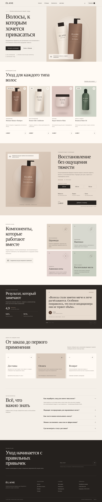

# ÉLANE — Beauty Store Case

Адаптивный одностраничный интернет-магазин профессионального ухода за волосами. Проект создан как портфолио-кейс по HTML/CSS-вёрстке и разработке e-commerce-интерфейсов.

## Демо

[Открыть опубликованный сайт](https://gleb-afk.github.io/beauty-store-case/)



## Возможности

- адаптивная вёрстка для компьютеров, планшетов и телефонов;
- каталог товаров с избранным и добавлением в корзину;
- выбор объёма главного продукта с изменением цены;
- интерактивный слайдер отзывов;
- плавный FAQ-аккордеон;
- мобильное выдвижное меню;
- форма подписки с обработкой состояния;
- семантическая HTML-разметка и ARIA-атрибуты.

## Технологии

- HTML5;
- CSS3;
- Flexbox и CSS Grid;
- CSS-переменные;
- адаптивная вёрстка;
- JavaScript без сторонних библиотек;
- GitHub Pages.

## Структура проекта

```text
beauty-store-case/
├── assets/
│   ├── icons/
│   └── images/
│       └── preview.png
├── css/
│   ├── variables.css
│   ├── base.css
│   ├── components.css
│   ├── sections.css
│   └── responsive.css
├── js/
│   └── script.js
├── index.html
└── README.md
```

## Адаптивность

Интерфейс проверен на основных диапазонах ширины:

- 1440 px — большой экран;
- 1024 px — ноутбук и планшет;
- 768 px — планшет;
- 560 px — небольшой планшет;
- 390 px — мобильный экран;
- 320 px — минимальная поддерживаемая ширина.

## Локальный запуск

1. Склонируйте репозиторий или скачайте архив.
2. Откройте папку проекта в Visual Studio Code.
3. Запустите `index.html` через расширение Live Server.

Сборщик и установка зависимостей не требуются.

## О проекте

ÉLANE — вымышленный бренд. Проект разработан в учебных и демонстрационных целях. Основной акцент сделан на визуальной иерархии, типографике, адаптивности и коммерческих сценариях интернет-магазина.
